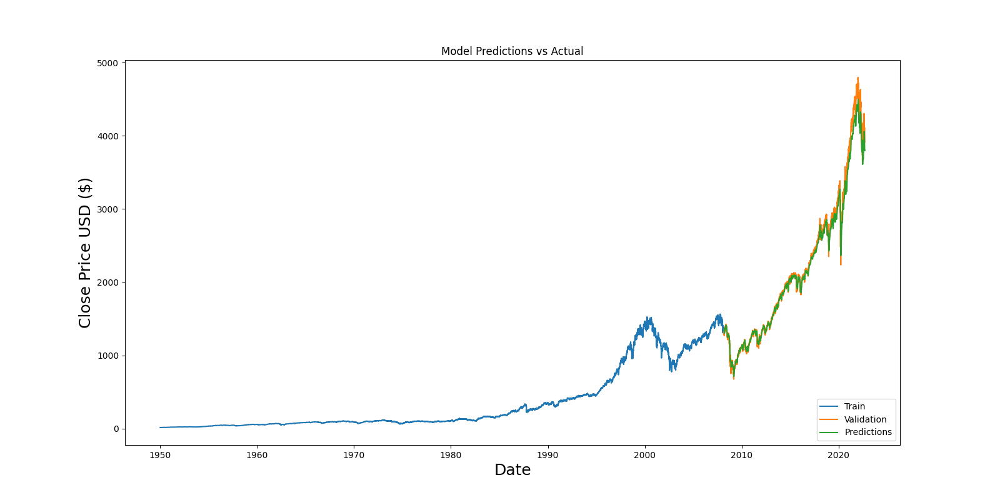

# Results

## Experiment setup
- Dataset: S&P 500 historical close prices (`data/sp500.csv`)
- Date range: 1950-01-03 → 2022-09-12
- Forecast target: next-day close (univariate)
- Sequence length: 60
- Split: 80/20 time-ordered (no shuffling)
- Leakage control: MinMaxScaler fit on training portion only
- Reproducibility: fixed seeds (Python, NumPy, TensorFlow)

## Train/Test sizes
- Total points: 18,292
- Train points: 14,634
- Test points: 3,658

## Metrics (test set)
| Model | RMSE | MAE |
|------|-----:|----:|
| LSTM (2-layer, 50 units, 5 epochs) | 274.23664722415276 | 152.85022272511256 |
| Naive baseline (persistence: ŷ[t] = y[t-1]) | 28.176117356100224 | 17.10673160256971 |

## Plot

## Interpretation (what these results mean)
- In this run, the naive persistence baseline significantly outperforms the LSTM on the held-out test set (RMSE 28.18 vs 274.24).
- This indicates the current model configuration and/or the evaluation framing is not yet producing a reliable forecasting model for this dataset split.
- The artifact is still valuable as a reproducible and leakage-aware pipeline, but the modeling stage requires additional work (feature representation, objective choice, baselines, and walk-forward evaluation) before making performance claims.

## Notes
- The “Predicted next day close” output is included for demonstration only and is not trading advice.
- Next-step priorities: verify correct target definition, add walk-forward validation, and evaluate on returns/log-returns as an alternative target.
